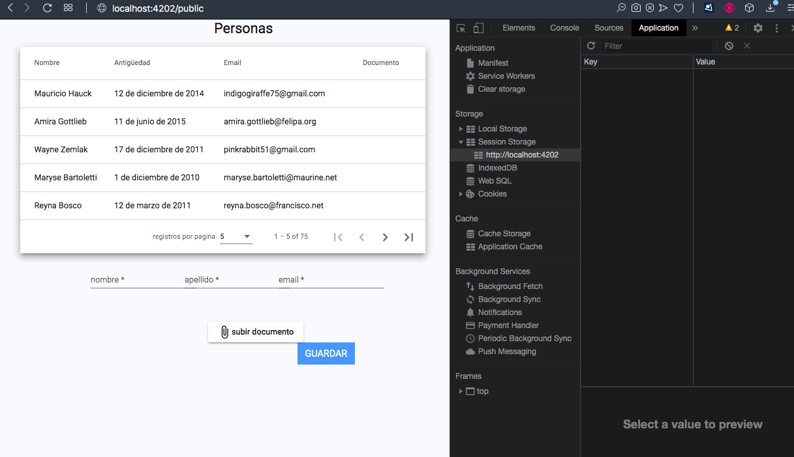
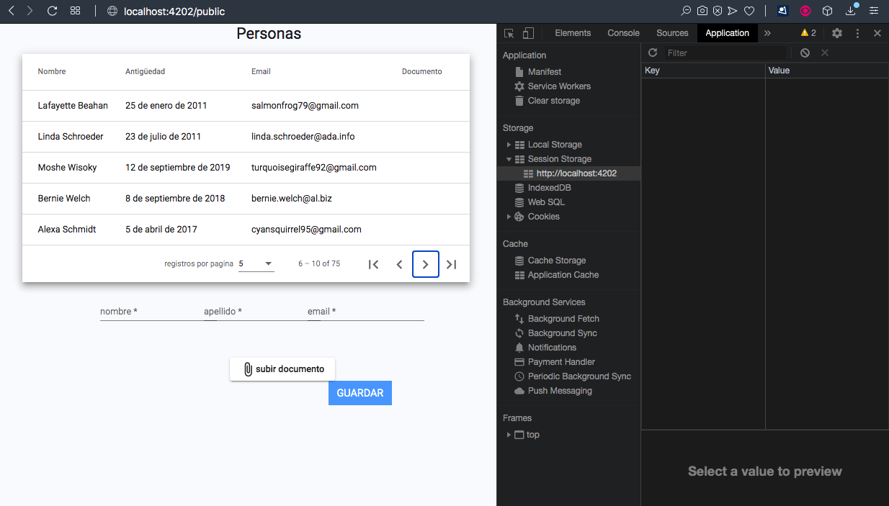
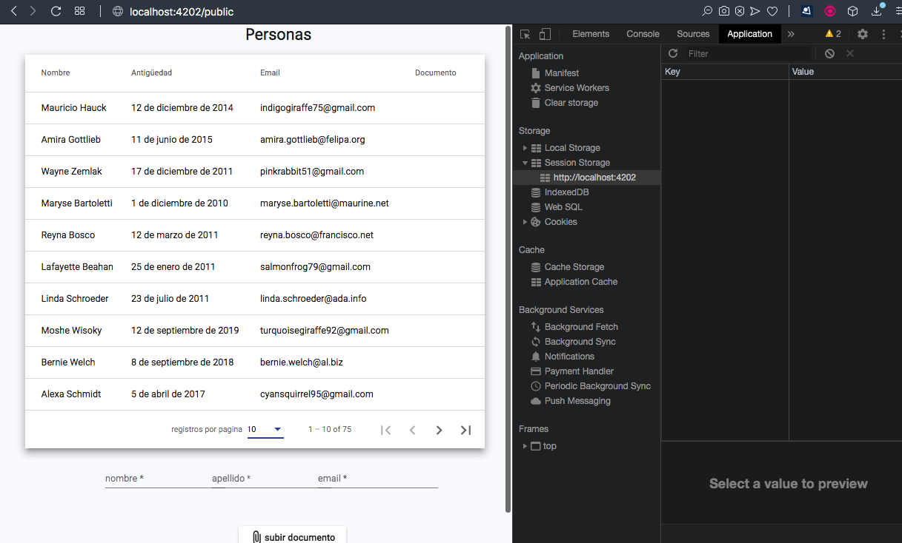
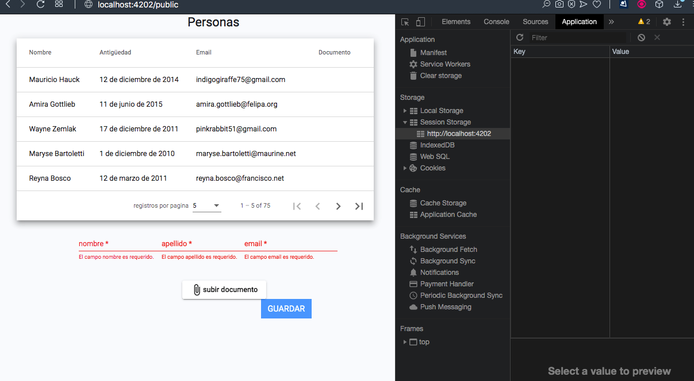
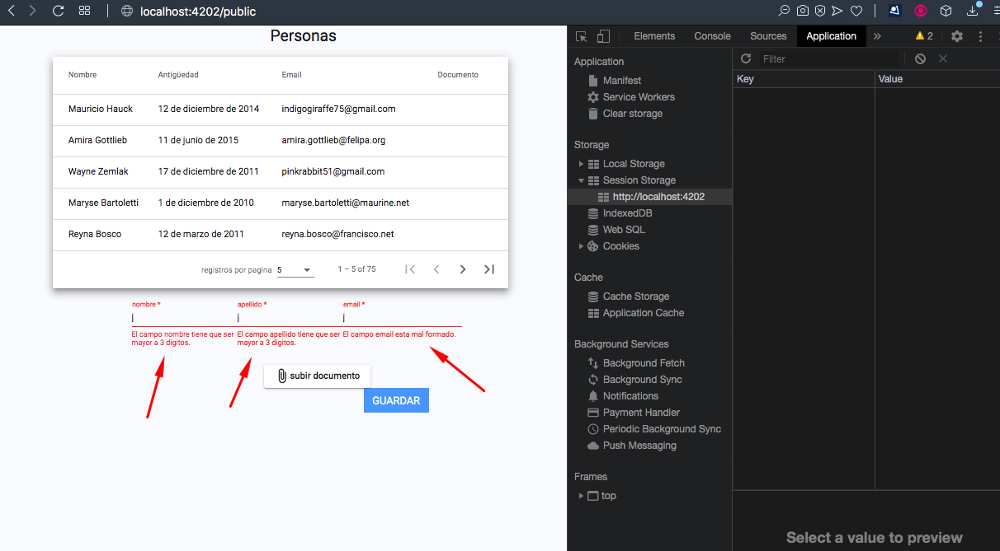
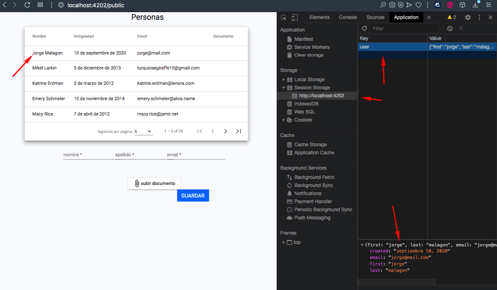
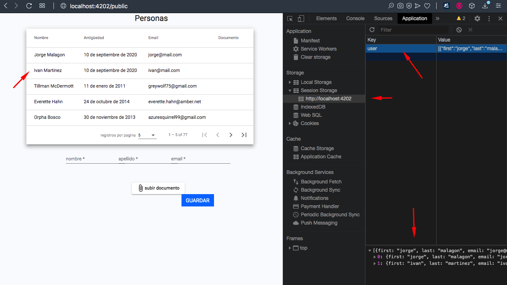
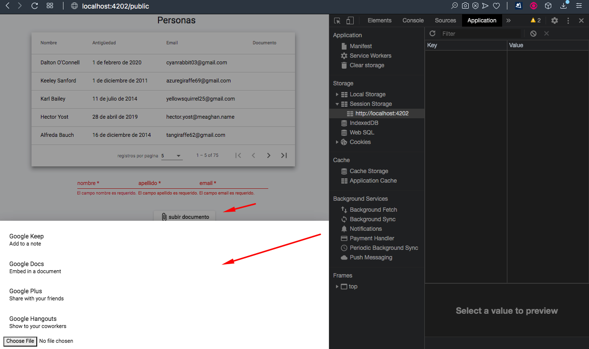

# FIRST

The first step is clone repo to local

# SECOND

After clone repo to local, you need to change your path into the project and exec `npm i` to install all npm dependencies

# THIRD

Exec `ng serve` to exec local and open `http://localhost:4200`

# SYSTEM

# 1
The system will automatically detects that if the browser has some info in Storage to add it on TOP of the user´s list, else only the users gived by the API are displayed

# 2

The info are displayed in materialTable with paginator, if you want to display more rows than default or paginete you only need to make click on the correct button

# 3

Here are the create user formValidator

# 4

After create the first new user, it was stored on sessionStorage and added on tableList on top of it.

# 5

If you want to add more users, they will be add on top but inorder to added.

# 6

The button add file display a modal that can let you choose fom upload file or select file from other place.

# Test

This project was generated with [Angular CLI](https://github.com/angular/angular-cli) version 10.0.7.

## Development server

Run `ng serve` for a dev server. Navigate to `http://localhost:4200/`. The app will automatically reload if you change any of the source files.

## Code scaffolding

Run `ng generate component component-name` to generate a new component. You can also use `ng generate directive|pipe|service|class|guard|interface|enum|module`.

## Build

Run `ng build` to build the project. The build artifacts will be stored in the `dist/` directory. Use the `--prod` flag for a production build.

## Running unit tests

Run `ng test` to execute the unit tests via [Karma](https://karma-runner.github.io).

## Running end-to-end tests

Run `ng e2e` to execute the end-to-end tests via [Protractor](http://www.protractortest.org/).

## Further help

To get more help on the Angular CLI use `ng help` or go check out the [Angular CLI README](https://github.com/angular/angular-cli/blob/master/README.md).
